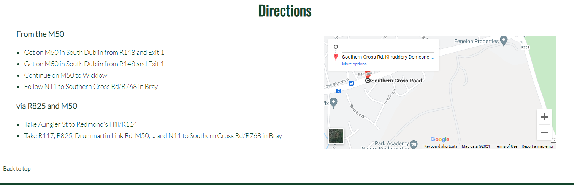

# Southern Cross Equestrian Centre

The goal of this project is to design and build a website to advertise an Equestrian Centre and inspire people 
to become customers.

It should provide information about the centre, what it offers, where it is and how to get there.
It should provide various means of contacing the organisers, phone numbers, email and submitting a question or query 
via a form.

# Wireframes
I have used [Balsamic](https://balsamiq.com/wireframes/ "Balsamic") to develop some wireframes for my website. 

The wireframes are below:

### [Home Desktop Wireframe](docs/wireframes/Home-Desktop.png "Home Desktop wireframe")
### [Home Tablet Wireframe](docs/wireframes/Home-Tablet.png "Home Tablet wireframe")
### [Home Phone Wireframe](docs/wireframes/Home-Phone.png "Home Phone wireframe")
### [Gallery Desktop Wireframe](docs/wireframes/Home-Desktop.png "Home Desktop wireframe")
### [Gallery Tablet Wireframe](docs/wireframes/Home-Tablet.png "Home Tablet wireframe")
### [Gallery Phone Wireframe](docs/wireframes/Home-Phone.png "Home Phone wireframe")
### [ContactUs Desktop Wireframe](docs/wireframes/ContactUs-Desktop.png "Home Desktop wireframe")
### [ContactUs Tablet Wireframe](docs/wireframes/ContactUs-Tablet.png "Home Tablet wireframe")
### [ContactUs Phone Wireframe](docs/wireframes/ContactUs-Phone.png "Home Phone wireframe")

After discussions with my mentor I decided to change the design a bit and move the images down to the sections ares to make them more interesting and I also left them larger and a more natural rectangular shape. I also changed the design from a three page site to a single page site again on advice from my mentor to make it more suitable for scrolling down on a phone.  

## Features 

The site consists of a single scrollable page with a hero image, an navigation bar, various content featuring images, a gallery section and a contact us section which also includes contact details, directions a map and a submit form for questions. 

### Existing Features

- __Navigation Bar__

  - Featured at the top of the page, the full responsive navigation bar includes links to the top or home section, Gallery and Contact Us sections. 
  - This allows the user to easily scroll down through the content. The back to top link is available after each section.

  - I had originally designed this to have three separate pages but changed it on the advice of my mentor as it provides a better mobile first experiance for the user.
  - Each section leads to the next leading to the invited conclusion of them making contact.

- __The landing page image__

  - The landing includes a photograph with text overlay of some riders enjoying a ride-out. It is intended to pique their interest. 
  - This section introduces the user to the equestrian center with an eye catching animation to grab their attention.

- __Inpirational Section__

  - The inspirational section will make the user imagine what it would be like to try riding in general and then encourage them to contact it by assuring them that it caters for everyone and also gives a taste of the options it offers. IT then encourates them to contact the centre by providing a link to the contact section. 

- __Welcome or About section__

  - This section gives some information about the centre and what it stands for . 
  - It provides a link to Aire - The Association of Irisk Riding Establishments - citing that the centre is fully approved. 

__Kids section__

  - This section focuses on kids, highlighting the fact that the centre is suitable for and welcomes kids. 
  - It also includes an image showing kids onb horseback having fun. 

__Adults section__

  - This section focuses on adults, highlighting the fact that the centre is also suitable for adults. 
  - It also includes an image showing adults on horseback having fun. 

__Livery section__

  - This section focuses on the livery service also provided extoling the virtues of keeping your horse or pony at the centre.
  - It also includes an image showing an horse in a rug looking content. 

__Gallery section__

  - The gallery will provide the user with supporting images to see what fun it is to ride at the centre. 
  - This section is valuable to the user as they will be able to easily identify the types of activities that take place at the centre. 

- __The Contact Us Section__

  - This page will allow the user to get in contact with the centre in a number of ways. The phone number , address and email details are provided along with a form they can fill in to ask a question. There is validation which ensures all fields are filled out prior to submission. It also provides directions to the centre including a map.

- __The Footer__ 

  - The footer section includes links to social media sites. The links will open to a new tab to allow easy navigation for the user. 
  - The footer is valuable to the user as it encourages them to keep connected via social media.

### Features Left to Implement

- Implementation of proper submission of the form in contact us rather than just displaying a dummy page.
- Implementation of logo and nav menu as a fixed position feature that remains in place as you scroll.
- Implementation of the 'Back to top' link as a fixed position feature available at all times.
- Implementation of a tack shop where items can be purchased.
  
## Testing 

To test this site I did the following:-
First I tested the site on a mobile device
1) Clicked the site url in github - https://evelynfoy.github.io/southern-cross-equestrian-center/
   The site appeared quickly and looked well.
   The logo aligned snuggly to the left.
   The menu was also left aligned beneath it
   The hero image appeared and the animation ran successfully. The hero image that appeared was the correct one for a small screen which is centered on a single horse.
2) I clicked the Home link
   It remained at the top correctly.
3) I clicked the Gallery link
   Initially this did not work. I checked the code and found that the id link was missing from the section. I added it in.
4) I clicked the Contact Us link
   It brought me successfully to the contact form.
5) I clcked the Directions link displayed.
   It brought me successfully to the Directions section.
   The directions were displayed correctly one on top of the other with the map underneath.
6) I clicked the 'Back to top' link displayed under the map and it brought me successfully back to the top.
7) I viewed the hero image and confirmed that the slogan statement appeared correctly for a small screen.
8) I scrolled down past the inspirational section noting that it was displayed correctly.
9) I clicked the 'Ready to take the first step' link which took me successfully to the Contact Us section.
10) I noted that the placeholder text appeared successfully in the 'Go for it' text area. 
11) I clcked the submit form button.
    A validation message appeared requesting I fill in the first name field.
    I filled that in and clicked submit.
    A validation message appeared requesting I fill in the last name field.
    I filled that in and clicked submit.
    A validation message appeared requesting I fill in the email field.
    I filled that in and clicked submit.
    A validation message appeared requesting I fill in a valid email.
    I filled that in and clicked submit.
    A validation message appeared requesting I fill in the 'Go for it' field with my query.
    I filled that in and clicked submit.
    A success message appeared stating that my form had been recived by the Southern Cross Equestrian Centre.
    As I clicked each field I saw that the border changed color as a visual aid.
12) I clicked 'Back to top' and scrolled through again.
    The Welcome section appeared correctly.
13) I clicked the link to 'Aire'.
    It opened successfully in a new window.
14) I returned to the site and continued scrolling.
    The images appeared correctly under the text and one under the next.
    Each section appeared correctly. Kids,adults and livery.
15) I arrived at the Gallery section.
    The images were all appearing correctly one under the other with a small gap in between for effect.
    The images were reduced in size and looked sharp and clear and not distorted. 
16) I checked the social media icons in the footer and noticed that one icon was appearing below the others.
    I returned to the code and changed the css to reduce the space in between the icons for small screens. 
17) I clicked each socila media icon and confirmed that all were working.

I then tested the site on a tablet and confirmed that it displayed as exected.
I then tested it on a desktop and confirmed that it displayed there correctly also.

For these the large hero image was displayed, images were displayed beside the appropriate text and the gallery displayed images 3 abreast.
The map was displayed beside the directions.

I noted the site was easy to use and navigate around. I was able to find various information easily and the experiance was pleasant.

### Validator Testing 
- HTML
  - No errors were returned when passing through the official [W3C validator](https://validator.w3.org/nu/?doc=https%3A%2F%2Fevelynfoy.github.io%2Fsouthern-cross-equestrian-center%2Findex.html)
  
- CSS
  - No errors were found when passing through the official [(Jigsaw) validator](http://jigsaw.w3.org/css-validator/validator?uri=https%3A%2F%2Fevelynfoy.github.io%2Fsouthern-cross-equestrian-center%2F&profile=css3svg&usermedium=all&warning=1&vextwarning=)
  

### Unfixed Bugs

I notice the favicon icon I added is not appearing in the deployed site.
It does work in git pod see image.

## Deployment
I created a repository in github for this project https://github.com/evelynfoy/southern-cross-equestrian-center
I then used the gitpod editor to build it.

- The site was deployed to GitHub pages. The steps to deploy are as follows: 
  - In the GitHub repository, navigate to the Settings tab 
  - Then click the Pages tab.
  - From the source section drop-down menu, select the Master Branch
  - Once the master branch has been selected, the page will be automatically refresh with a link to the deployed site. 

The live link can be found here - https://evelynfoy.github.io/southern-cross-equestrian-center/

## Credits 

### Content 

The text for the Home page was made up but inspired from my research sites.

For content and style inspiration,
* [carrickminesequestrian.ie](https://www.carrickminesequestrian.ie/ "Carrickmines Equestrian Centre")
* [Brennanstown Riding School](https://www.brennanstownrs.ie/ "Brennanstown Riding School")
* [The Padocks Riding Centre](http://www.paddocks.ie/ "The Padocks Riding Centre")
* [Example site provided by mentor](https://github.com/sam-timmins/T4Tri-triathlon-club "T4Tri-triathlon-club")

For code inspiration, help and advice,
* [Simen Daehlin](https://github.com/Eventyret "Simen Daehlin")
* [Chris Quinn](https://github.com/2BN-Chris_mentor "Chris Quinn")

- The icons in the footer were taken from [Font Awesome](https://fontawesome.com/)
- The fonts I used are Lato and Oswald are from Google Fonts [Lato](https://fonts.google.com/?query=Lato "Lato") and [Oswald](https://fonts.google.com/?query=Oswald "Oswald")

### Media

  The photos used on this site are all from the websites sited above as my research sites
* [carrickminesequestrian.ie](https://www.carrickminesequestrian.ie/ "Carrickmines Equestrian Centre")
* [Brennanstown Riding School](https://www.brennanstownrs.ie/ "Brennanstown Riding School")
* [The Padocks Riding Centre](http://www.paddocks.ie/ "The Padocks Riding Centre")

